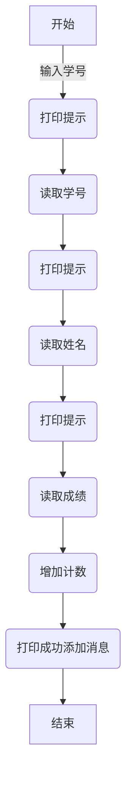
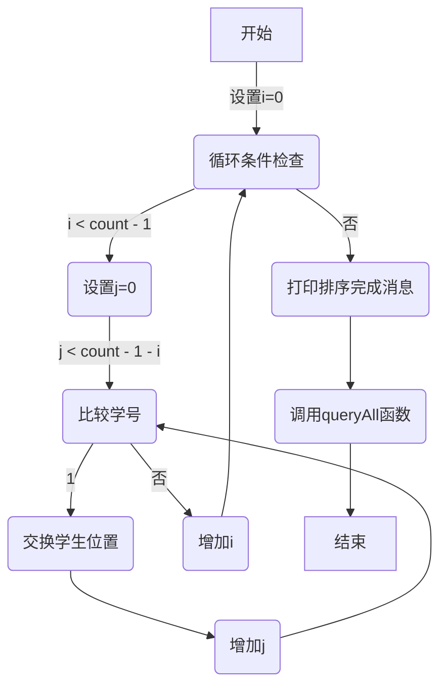

# 软件工程

## 考试


## 各种图的画法

### 流程图

链接：https://zhuanlan.zhihu.com/p/347119698

常见的一些符号


三大结构：顺序，选择，循环

顺序：


选择：


循环：




使用markdown做图



### E-R图

https://www.zhihu.com/tardis/zm/art/270299029?source_id=1005

E-R图又称实体关系图，是一种提供了实体，属性和联系的方法，用来描述现实世界的概念模型。通俗点讲就是，当我们理解了实际问题的需求之后，需要用一种方法来表示这种需求，概念模型就是用来描述这种需求。

基本元素：

1. 实体：客观存在的并且可以相互区别的事物称为实体，如学生
2. 属性：实体所具有的某一个特性称为属性，如姓名，班级
3. 实体集：具有相同属性的实体的集合称为实体集，如全体学生
4. 键：唯一标识每个实体的属性称为键，如不重复的学号
5. 实体型：用实体名及其属性名集合来抽象和刻画同类实体称为实体型，如(学号，姓名，班级..)
6. 联系：一对一联系，一对多联系，多对多联系

E-R图的规范：

+ 矩形框：表示实体，框中记入实体名
+ 菱形框：表示联系，在框中记入联系名
+ 椭圆框：表示实体或联系的属性
+ 连线：实体与属性之间；实体与联系之间；联系与属性之间用直线相连，并在直线上标注(1:1,1:n,n:m)

学生管理系统 E-R图


### 数据流图

https://zhuanlan.zhihu.com/p/149291955

数据流图（DFD，Data Flow Diagram）也称分层数据流图，是在需求分析阶段用到的一种工具，在结构化的需求分析中，DFD的使用频度极高。


画数据流图步骤：

1. 先画系统的输入和输出，构建顶层DFD
2. 对顶层DFD图细化，构建0层DFD
3. 逐层细化


一些注意事项：

+ 数据存储和数据流都是数据，仅仅所处的状态不同。数据存储是处于静止状态的数据，数据流是处于运动中的数据。
+ 每个加工至少有一个输入数据流和一个输出数据流，反映出此加工数据的来源与加工的结果。

数据流图分层：


数据流图分层 , 最上层是 顶层数据流图 , 第二层是 0  层数据流图 , ⋯ , 最底层是 底层数据流图 


#### 题目

> https://blog.csdn.net/weixin_44949135/article/details/111771085
>
> 高考录取统分子系统有如下功能：
>
>  (1) 计算标准分：根据考生原始分计算，得到标准分，存入考生分数文件；
>
>  (2) 计算录取线分：根据标准分、招生计划文件中的招生人数，计算录取线，存入录取线。
>
> 要求：用结构化方法学对高考录取统分子系统进行分析与设计，分别完成以下工作：
> ①  给出高考录取统分子系统的功能模型（用数据流图表示）。② 给出高考录取统分子系统的软件体系结构（用模块结构图表示）。


### 软件结构图

https://blog.csdn.net/weixin_44611096/article/details/111311549

结构图（Structure Chart，简称SC图）是精确表达软件结构的图形表示方法，它以特定的符号表示模块、模块间的调用关系和模块间信息的传递。


将上面的数据流图转为如下的软件结构图，下图：数据传输应该用小圆圈，箭头方向反了


### UML图

> 以下内容转载：https://zhuanlan.zhihu.com/p/109655171

UML——Unified modeling language UML(统一建模语言)，是一种用于软件系统分析和设计的语言工具，它用于帮助软件开发人员进行思考和记录思路的结果

#### 类的表示

类在类图中用矩形框表示，矩形框分为三层：第一层是类名字。第二层是类的成员变量；第三层是类的方法。成员变量以及方法前的访问修饰符用符号来表示：

- “+”表示 `public`；
- “-”表示 `private`；
- “#”表示 `protected`；
- 不带符号表示 `default`。


#### 抽象类

抽象类在UML类图中同样用矩形框表示，但是抽象类的类名以及抽象方法的名字都用斜体字表示


#### 接口

接口在类图中的第一层顶端用构造型 `<<interface>>`表示，下面是接口的名字，第二层是方法


#### 关系

关系共有六种类型，分别是实现关系、泛化关系、关联关系、依赖关系、聚合关系、组合关系

##### 实现

实现关系是指接口及其实现类之间的关系。在UML类图中，实现关系用空心三角和虚线组成的箭头来表示，从实现类指向接口。


##### 泛化

泛化关系（Generalization）是指对象与对象之间的继承关系。如果对象A和对象B之间的“is a”关系成立，那么二者之间就存在继承关系，对象B是父对象，对象A是子对象。例如，一个年薪制员工“is a”员工，很显然年薪制员工Salary对象和员工Employee对象之间存在继承关系，Employee对象是父对象，Salary对象是子对象。

在UML类图中，泛化关系用空心三角和实线组成的箭头表示，从子类指向父类，如图8所示。在Java代码中，对象之间的泛化关系可以直接翻译为关键字 `extends`。


##### 关联

关联关系（Association）是指对象和对象之间的连接，它使一个对象知道另一个对象的属性和方法。在Java中，关联关系的代码表现形式为一个对象含有另一个对象的引用。也就是说，如果一个对象的类代码中，包含有另一个对象的引用，那么这两个对象之间就是关联关系。

关联关系有单向关联和双向关联。如果两个对象都知道（即可以调用）对方的公共属性和操作，那么二者就是双向关联。如果只有一个对象知道（即可以调用）另一个对象的公共属性和操作，那么就是单向关联。大多数关联都是单向关联，单向关联关系更容易建立和维护，有助于寻找可重用的类。

在UML图中，双向关联关系用带双箭头的实线或者无箭头的实线双线表示。单向关联用一个带箭头的实线表示，箭头指向被关联的对象，如图9所示。这就是导航性（Navigatity）。


一个对象可以持有其它对象的数组或者集合。在UML中，通过放置多重性（multipicity）表达式在关联线的末端来表示。多重性表达式可以是一个数字、一段范围或者是它们的组合。多重性允许的表达式示例如下：

- 数字：精确的数量
- `*`或者`0..*`：表示0到多个
- `0..1`：表示0或者1个，在Java中经常用一个空引用来实现
- `1..*`：表示1到多个

关联关系又分为依赖关联、聚合关联和组合关联三种类型。

##### 依赖

依赖（Dependency）关系是一种弱关联关系。如果对象A用到对象B，但是和B的关系不是太明显的时候，就可以把这种关系看作是依赖关系。如果对象A依赖于对象B，则 A “use a” B。比如驾驶员和汽车的关系，驾驶员使用汽车，二者之间就是依赖关系。

在UML类图中，依赖关系用一个带虚线的箭头表示，由使用方指向被使用方，表示使用方对象持有被使用方对象的引用，如图10所示。


依赖关系在Java中的具体代码表现形式为**B为A的构造器**或**方法中的局部变量**、**方法或构造器的参数**、**方法的返回值**，或者**A调用B的静态方法**。

下面我们用代码清单1和代码清单2所示的Java代码来演示对象和对象之间的依赖关系。

代码清单1所示的`B`类定义了一个成员变量 `field1`，一个普通方法 `method1()` 和一个静态方法 `method2()`。

```text
//代码清单1 B.java
public class B {
  public String field1;   //成员变量

  public void method1() {
    System.println("在类B的方法1中");
  }

  public static void method2() {                 //静态方法
    System.out.println("在类B的静态方法2中");
  }
}
```

代码清单2所示的`A`类依赖于`B`类，在`A`类中定义了四个方法，分别演示四种依赖形式。

```text
/* 代码清单2 A.java
  A依赖于B
*/

public class A {
  public void method1() {
    //A依赖于B的第一种表现形式：B为A的局部变量
    B b = new B();
    b.method1();
  }

  public void method2() {
    //A依赖于B的第二种表现形式： 调用B的静态方法
    B.method2();
  }

  public void method3(B b)  {
    //A依赖于B的第三种表现形式：B作为A的方法参数
    String s = b.field1;
  }

  //A依赖于B的第四种表现形式：B作为A的方法的返回值
  public B method4() {
    return new B();
  }
}
```

##### 聚合与组合

聚合（Aggregation）是关联关系的一种特例，它体现的是整体与部分的拥有关系，即 “has a” 的关系。此时整体与部分之间是可分离的，它们可以具有各自的生命周期，部分可以属于多个整体对象，也可以为多个整体对象共享，所以聚合关系也常称为共享关系。例如，公司部门与员工的关系，一个员工可以属于多个部门，一个部门撤消了，员工可以转到其它部门。

在UML图中，聚合关系用空心菱形加实线箭头表示，空心菱形在整体一方，箭头指向部分一方，如图11所示。


组合（Composition）也是关联关系的一种特例，它同样体现整体与部分间的包含关系，即 “contains a” 的关系。但此时整体与部分是不可分的，部分也不能给其它整体共享，作为整体的对象负责部分的对象的生命周期。这种关系比聚合更强，也称为强聚合。如果`A`组合`B`，则`A`需要知道`B`的生存周期，即可能`A`负责生成或者释放`B`，或者`A`通过某种途径知道`B`的生成和释放。

例如，人包含头、躯干、四肢，它们的生命周期一致。当人出生时，头、躯干、四肢同时诞生。当人死亡时，作为人体组成部分的头、躯干、四肢同时死亡。

在UML图中，组合关系用实心菱形加实线箭头表示，实心菱形在整体一方，箭头指向部分一方，如图12所示。


在Java代码形式上，聚合和组合关系中的部分对象是整体对象的一个成员变量。但是，在实际应用开发时，两个对象之间的关系到底是聚合还是组合，有时候很难区别。在Java中，仅从类代码本身是区分不了聚合和组合的。如果一定要区分，那么如果在删除整体对象的时候，必须删掉部分对象，那么就是组合关系，否则可能就是聚合关系。从业务角度上来看，如果作为整体的对象必须要部分对象的参与，才能完成自己的职责，那么二者之间就是组合关系，否则就是聚合关系。

例如，汽车与轮胎，汽车作为整体，轮胎作为部分。如果用在二手车销售业务环境下，二者之间就是聚合关系。因为轮胎作为汽车的一个组成部分，它和汽车可以分别生产以后装配起来使用，但汽车可以换新轮胎，轮胎也可以卸下来给其它汽车使用。如果用在驾驶系统业务环境上，汽车如果没有轮胎，就无法完成行驶任务，二者之间就是一个组合关系。再比如网上书店业务中的订单和订单项之间的关系，如果订单没有订单项，也就无法完成订单的业务，所以二者之间是组合关系。而购物车和商品之间的关系，因为商品的生命周期并不被购物车控制，商品可以被多个购物车共享，因此，二者之间是聚合关系。


## 一些概念

### 数据字典

数据流箭头上只标明了 “账号信息” , 没有具体的格式内容 , 是只有账号 , 还是有账号/密码/验证码等信息 , 这些数据详细格式 , 都在 数据字典中定义 ;

数据字典是指对数据的[数据项](https://baike.baidu.com/item/数据项/3227309?fromModule=lemma_inlink)、[数据结构](https://baike.baidu.com/item/数据结构/1450?fromModule=lemma_inlink)、[数据流](https://baike.baidu.com/item/数据流/3002243?fromModule=lemma_inlink)、[数据存储](https://baike.baidu.com/item/数据存储/9827490?fromModule=lemma_inlink)、处理逻辑等进行定义和描述，其目的是对[数据流图](https://baike.baidu.com/item/数据流图/4136477?fromModule=lemma_inlink)中的各个元素作出详细的说明，使用数据字典为简单的建模项目。简而言之，数据字典是[描述数据](https://baike.baidu.com/item/描述数据/5133915?fromModule=lemma_inlink)的信息集合，是对系统中使用的所有[数据元素](https://baike.baidu.com/item/数据元素/715313?fromModule=lemma_inlink)的定义的集合。


